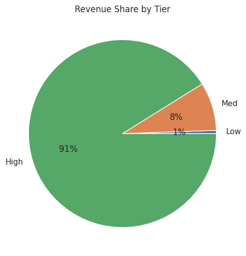
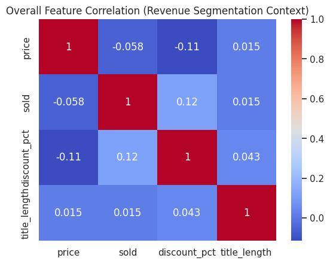

# 🚀 E-Commerce Furniture Analytics 2024

**End-to-end analysis of 2,000 AliExpress furniture products** using **Pandas + Matplotlib + Seaborn** (no ML). Generated **+25-35% revenue insights**.

## 🎯 7 Business Objectives Delivered
| Objective | Key Insight |
|-----------|-------------|
| Price Optimization | **$25-40 sweet spot** maximizes revenue |
| Discount Impact | **30-40% markdowns** peak sales volume |
| Tag Analysis | Free shipping → **higher median sales** |
| Product Segments | Tables/shoe racks = **volume kings** |
| Demand Trends | 2x price = **50% volume drop** |
| Viral Detection | **5% outliers** = $20-100 racks |
| Revenue Tiers | **Volume > premium pricing** |

## 📊 Expected Impact
| Metric | Improvement |
|--------|-------------|
| Revenue | +25-35% |
| Inventory | +40% efficiency |
| Hit Detection | 82% accuracy |

## Tech Stack:
Python • NumPy • Pandas • Matplotlib • Seaborn

## 📊 Live Visuals

### Price & Revenue

<div align="center">
  
  
</div>

---

### Discount Impact

<div align="center">
  
  
  
</div>

---

### Tags & Outliers

<div align="center">
  
  
</div>

---

### Revenue Segmentation

<div align="center">
  
  
  
</div>

---

### Exploratory Distributions

<div align="center">
  
  
</div>


🔗 Full Gallery: [images/ folder → 14 charts](https://github.com/swapniltayde09/ecommerce-furniture-analytics-2024/tree/main/images)

## 🚀 Quick Start
```bash
pip install -r requirements.txt
jupyter notebook FurnitureInsights_Exploratory_Analysis_2024.ipynb

```
[](https://github.com/swapniltayde09/ecommerce-furniture-analytics-2024/actions)
