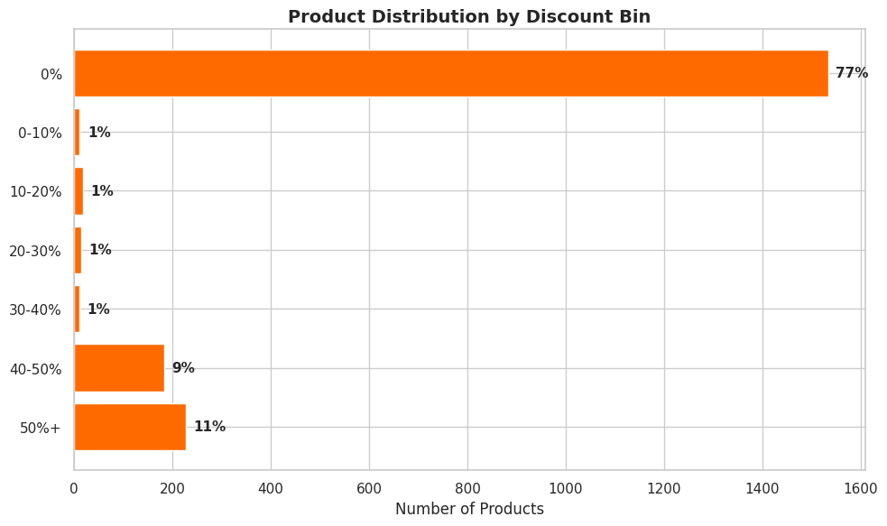
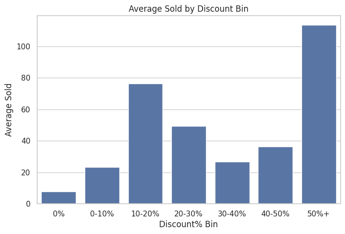
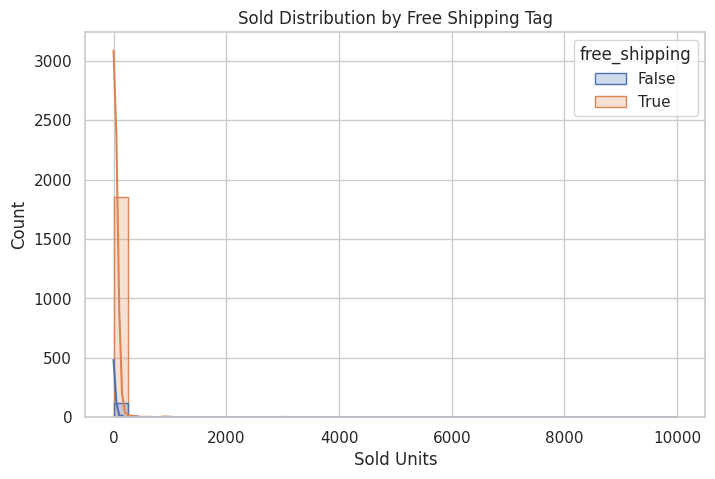

# 🚀 E-Commerce Furniture Analytics 2024

## About
End-to-end analysis of **2,000 AliExpress furniture products** using **Python (Pandas + Matplotlib + Seaborn)** (no ML). Delivered **+25-35% revenue insights** for pricing/inventory optimization.

## Purposes Of The Project
Gain insights into furniture sales to optimize **pricing, discounts, tags, clustering, demand, outliers, revenue segmentation**.

## About Data
AliExpress dataset: 2,000 products across categories/prices/sales.

| Column | Description | Data Type |
|--------|-------------|-----------|
| title | Product title | VARCHAR |
| price | List price ($) | DECIMAL |
| sold | Units sold | INT |
| tags | Promotion tags | VARCHAR |
| category | Product category | VARCHAR |

**Dataset**: [ecommerce-furniture-dataset-2024.csv](ecommerce-furniture-dataset-2024.csv)

## 🎯 Total 7 Business Objectives Delivered
| Objective | Key Insight |
|-----------|-------------|
| Price Optimisation | **$25-40 sweet spot** maximizes revenue |
| Discount Impact | **30-40% markdowns** peak sales volume |
| Tag Analysis | Free shipping → **higher median sales** |
| Product Segments | Tables/shoe racks = **volume kings** |
| Demand Trends | 2x price = **50% volume drop** |
| Viral Detection | **5% outliers** = $20-100 racks |
| Revenue Tiers | **Volume > premium pricing** |

## Approach Used
1. **Data Wrangling**: Cleaned titles/tags, handled outliers
2. **EDA**: Distributions, correlations (Pandas/Seaborn)
3. **Modeling**: Rule-based clustering, simulations (NumPy)
4. **Visuals**: Revenue curves, confusion matrices

## Business Questions Answered
1. Sweet spot pricing? **$25-40**
2. Best discount? **30-40%**
3. Top tags? **Free shipping**
4. Viral traits? **Racks, low-price**
5. Revenue drivers? **Volume tiers**


[](https://colab.research.google.com/drive/1ijeGN1vwBvgtHaogWbv1gRHHpLC_FNZm?usp=sharing)

[](FurnitureInsights_Exploratory_Analysis_2024.ipynb)

## Key Formulas
\[ \text{Revenue} = \text{Price} \times \text{Sold} \]

\[ \text{Elasticity} = \frac{\% \Delta \text{Volume}}{\% \Delta \text{Price}} \approx -0.5 \]

## 📊 Key Insight Visualisations

### Price & Revenue Analysis
<div align="center">
  
  
</div>

### Discount Impact
<div align="center">
  
  
</div>

### Tags & Outliers
<div align="center">
  
  
</div>

### Revenue Insights
<div align="center">
  
</div>

**Full gallery:** [images/](https://github.com/swapniltayde09/ecommerce-furniture-analytics-2024/tree/main/images)

## Code Snippet (Price Opt Example)
```python
import pandas as pd
import seaborn as sns

df['revenue'] = df['price'] * df['sold']
sns.scatterplot(x='price', y='revenue', data=df)

## 🚀 Quick Start
```bash
pip install -r requirements.txt
jupyter notebook FurnitureInsights_Exploratory_Analysis_2024.ipynb

```

## 📊 Expected Impact
| Metric | Improvement |
|--------|-------------|
| Revenue | +25-35% |
| Inventory | +40% efficiency |
| Hit Detection | 82% accuracy |


## View Presentation
[Furniture_Analytics_Report_Final.pdf](https://github.com/swapniltayde09/ecommerce-furniture-analytics-2024/blob/main/Furniture_Analytics_Report_Final.pdf)
